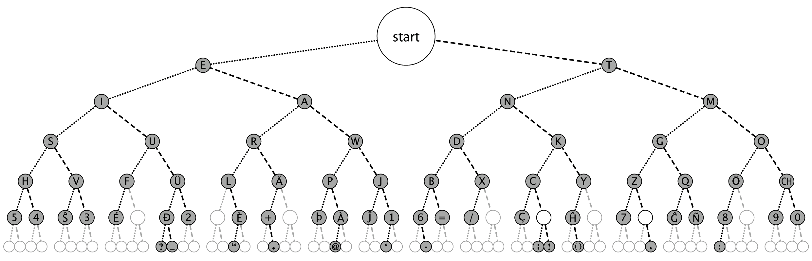
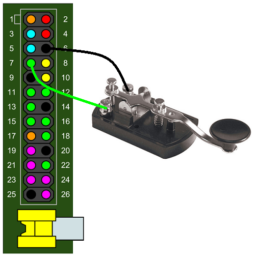
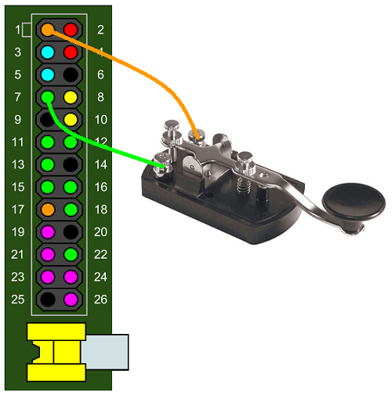

## Introduction: what is Morse Code?


Invented by [Samuel Morse](http://en.wikipedia.org/wiki/Samuel_F._B._Morse) in the year 1836, Morse Code is a method for sending and receiving text messages using short and long beeps. Conventionally a short beep is called a *dot* and a long one is a *dash* (also known as a *dit* and a *dah*). Every letter of the alphabet has a unique sequence of dots and dashes.

If you look at the chart below, the letter **A** is beep beeeeeep.

The letter **B** is beeeeeep beep beep beep.


- A dash is three times the length of a dot
- Each dot or dash has a short gap of silence after it
- Letters in a word have a slightly longer gap of silence between them
- Words have an even longer gap of silence between them

You don't necessarily need to use sound for this, although this is the most common way Morse Code was used. You can do it with anything that can be turned on and off. You could use a torch, raising and lowering a flag or even just blink your eyes fast and slow. This makes it one of the most versatile forms of telecommunication. There is even a formal international treaty which enshrines the Morse code for SOS `... --- ...` (Save Our Souls) as a universal distress signal.

In the 1890's morse code was adapted for use with early [radio](http://en.wikipedia.org/wiki/Radio_communication) before it was possible to send and recieve voice. It was done by simply sending pulses of a carrier wave at an agreed frequency. The recipients radio would then just play an audible tone whenever the carrier was received. It was used extensively during both World Wars and is still used to this day by amateur radio operators.

So there are three aspects to Morse
  - Knowing the code
  - Being able to key it in
  - Being able to decode it when listening

The choice of the dot and dash sequence for each letter is not random. Samuel Morse chose them based on how often letters occurred in the English language used by his local newspaper. The more commonly used a letter was the fewer dots and dashes he chose, thereby making it faster to key in.

The chart below is the Morse code tree and is really helpful when listening/decoding, you might want to print it out and have it always in front of you. You can see that **E** and **T** are the most common letters. So you start at the top, go to the *left* if you hear a dot and to the *right* if you hear a dash. You can double check this against the first chart, try it now for the letters **A** and **B**.



Get a pencil and paper and see how you get on with this: [Listen to slow Morse Code](./sounds/slow_morse.mp3). Don't be intimidated if you find this hard. It's always tricky to start with. As with many things, the more you do it the easier it gets. In this resource we're going to program the Raspberry Pi to help you learn how to do this. You're going to build your own learning tool which will tell you if you're getting it right or not, so let's get set up.

## Step 0: Setting Up your Pi

First check that you have all the parts you need to get your Raspberry Pi set up and working.

- Raspberry Pi
- Micro USB power adaptor
- An SD card with Raspbian already set up through NOOBS
- USB keyboard
- USB mouse
- HDMI cable
- A monitor or TV

### Activity Checklist:

1. Place the SD card into the slot of your Raspberry Pi.
1. Next connect the HDMI cable from the monitor or TV.
1. Plug in the USB keyboard and mouse.
1. Plug in the micro USB power supply.
1. When prompted to login type:

    ```bash
    Login: pi
    Password: raspberry
    ```

## Step 1: Play a test beep

Headphones are advisable in a classroom environment so that the room doesn't descend into a cacophony of beep noise. If you *are* using headphones or a speaker on the Raspberry Pi, you will need to run the following command to redirect sound to the headphone socket:

`sudo amixer cset numid=3 1`

Next we're going to use the python pygame library to make some tone sounds.
First verify that the package is installed using the following command:

`sudo apt-get install python-pygame -y`

If your SD card is up to date you should see the message:

`python-pygame is already the newest version`

Okay now lets do some programming.  I'm going to provide some code to make the tone sound, you don't need to worry about its internal workings. For those of you that are interested though the code just inherits one of the pygame sound classes and automatically generates the wave data for playing a tone at a specified frequency.

Enter the following command to start editing a blank file:

`nano morse-code.py`

Now either copy and paste or enter the following code:
```python
#!/usr/bin/python
import pygame, time
from array import array
from pygame.locals import *

pygame.mixer.pre_init(44100, -16, 1, 1024)
pygame.init()

class ToneSound(pygame.mixer.Sound):
    def __init__(self, frequency, volume):
        self.frequency = frequency
        pygame.mixer.Sound.__init__(self, self.build_samples())
        self.set_volume(volume)

    def build_samples(self):
        period = int(round(pygame.mixer.get_init()[0] / self.frequency))
        samples = array("h", [0] * period)
        amplitude = 2 ** (abs(pygame.mixer.get_init()[1]) - 1) - 1
        for time in xrange(period):
            if time < period / 2:
                samples[time] = amplitude
            else:
                samples[time] = -amplitude
        return samples
```
Don't worry if you've never seen a python [class](http://en.wikipedia.org/wiki/Class_%28computer_programming%29) before. A class is like a blueprint of code that you can re-use multiple times. An instance of a class is known as an [object](http://en.wikipedia.org/wiki/Object-oriented_programming).

Typical Morse Code tones are somewhere between 400 Hz and 1000 Hz, so lets go for 800 Hz.
In this code `tone_obj` is the object that has been created from the blueprint `ToneSound`.
Add the following code to the very bottom of the file:

```python
tone_obj = ToneSound(frequency = 800, volume = .5)

tone_obj.play(-1) #the -1 means to loop the sound
time.sleep(2)
tone_obj.stop()
```
Press `Ctrl - O` then `Enter` to save followed by `Ctrl - X` to quit from editing.
Next mark the file as executable with the following command:

`chmod +x morse-code.py`

Now we can run the code, you should hear a nice two second long beep.

`./morse-code.py`

If you didn't hear anything then double check everything is plugged in correctly. If you're using the headphone jack of the Pi you'll need to use the command `sudo amixer cset numid=3 1` to redirect the audio. You may notice the tone sounds a bit wobbly at the start, this is just an artefact of pygame starting up and using up CPU cycles. Subsequent tones that we make will sound correct.

##Step 2: Connect the Morse Code key to the GPIO pins


### The Theory

All Morse Code keys work in a similar way to a push button or switch. They have two screw terminals for attaching a positive and a negative wire. When you press the key down two bits of metal touch causing a circuit to complete. The effect would be the same if you just touched the two wires together.

So to connect the Morse Key to the GPIO pins we need to do a bit of physical computing. GPIO pins can be set up as an input or an output. Output mode is for when you want to supply voltage to something like an LED or buzzer. In INPUT mode a GPIO pin has a value that we can read in our code. If the pin has voltage going to it the reading will be `1` *HIGH*. If the pin was connected directly to ground (no voltage) the reading will be `0` *LOW*. 

So the goal is to use the Morse Code key to switch voltage on and off for a GPIO pin. Thus making the reading of the pin change *in our code* when we press the key.

When a GPIO pin is in input mode the pin is said to be *floating* meaning that it has no fixed voltage level. That's no good for what we want, the pin will randomly float between HIGH and LOW. We need to categorically know either the key is up or down. So we need to fix the voltage level to HIGH or LOW and then make it change *only* when the key is pressed.

We can do this in two ways:

- A pull up circuit

  Wire the GPIO pin to 3.3 volts through a large 10kΩ resistor so that it always reads HIGH. Then we can short the pin to ground via the Morse Key so that the pin will go LOW when you press it.

  

- A pull down circuit

  Wire the GPIO pin to ground through a large 10kΩ resistor so that it always reads LOW. Then we can short the pin to 3.3 volts through the Morse key so that it goes HIGH when you press it. When the key is pressed there is a lower resistance path to 3.3 volts and therefore the pin will read HIGH. 

  
  
  *Note: The 1kΩ resistor is there in both circuits to give the GPIO pin a failsafe protection in case we mistakenly set the pin to be in OUTPUT mode.*

### The Practise

Fortunately the Raspberry Pi has all the above circuitry *built in* and we can select either a pull up or a pull down circuit **in our code** for each GPIO pin. This sets up some internal circuitry that is too small for us to see. So you can get away with just using two jumper wires here, although you're welcome to wire it up the way shown above if you wish. Let's use pin #7 as an example:

- Pull up configuration

  GPIO pin #7 will be wired to 3.3 volts using the internal pull up resistor so that it always reads HIGH. Then we can short the pin to ground via the Morse Key so that the pin will go LOW when you press it.

   

- Pull down configuration

  GPIO pin #7 will be wired to ground using the internal pull down resistor so that it always reads LOW. Then we can short the pin to 3.3 volts via the Morse Key so that the pin will go HIGH when you press it.

   

Neither way is any more correct than the other and which one people use is often just personal preference. Take the two jumper wires and screw the male ends into the terminal blocks on your Morse Code key. On some very old antique keys this can be a tricky operation.

 

Choose the pull up or down configuration you want to use and connect the female ends to the appropriate GPIO pins on your Raspberry Pi. Use the above diagrams as a guide. *Make a note of which configuration you're using as you'll need to incorporate it into your programming later.*

## Step 3: Detect the key position through the GPIO pin value

Enter the following command to edit our previous tone program:

`nano morse-code.py`

To give us access to the GPIO pins in our code we need to import the `RPi.GPIO` library.
Add `RPi.GPIO as GPIO` to the import line at the top so that it reads:

`import pygame, time, RPi.GPIO as GPIO`

At the bottom remove these lines (they will be put back in again later):
```python
tone_obj.play(-1)
time.sleep(2)
tone_obj.stop()
```
Either copy and paste or enter code below. Pay attention to the `GPIO.setup` command, this line is doing two things. It is setting pin 7 as an input *and* setting the internal pull up resistor on it. If you want to use the pull down resitor you'll need to use `GPIO.PUD_DOWN` instead.

There is then a while loop which continually reads the state of pin 7 and prints HIGH or LOW to the screen every second.
```python
pin = 7
GPIO.setmode(GPIO.BOARD)
GPIO.setup(pin, GPIO.IN, pull_up_down=GPIO.PUD_UP)

while True:
    reading = GPIO.input(pin)
    print "HIGH" if reading else "LOW"
    time.sleep(1)
```
Press `Ctrl - O` then `Enter` to save followed by `Ctrl - X` to quit from editing.
GPIO functions require root access on your Pi so from now on you must use the `sudo` command to run your code.
If you don't use `sudo` you'll see the following error `No access to dev/mem. Try running as root!`

`sudo ./morse-code.py`

If you're using a pull up the program should show HIGH when the key is up. Hold the button down for a few seconds and it will show LOW. It will be the opposite way around if you're using a pull down. The output should look something like this:
```bash
HIGH
HIGH
HIGH
LOW
LOW
LOW
HIGH
HIGH
HIGH
```
Press `Ctrl - C` to quit.

##Step 4: Play a tone when they key is down

We've now proven that the value of the GPIO pin is changing when we press the Morse key, so the electronics is done. But our code still very basic. All we have is a loop that keeps polling the pin, the code doesn't actually respond to the press or release of the key yet. You'll notice that you can press and release the key many times within one second.

To do Morse Code properly we need to respond every time the user presses or releases the key by starting and stopping the tone sound.

*Pro Tip*: The more experienced people reading this will be thinking about using hardware interrupts here. This is done in the `RPi.GPIO` library with the `add_event_detect` and `wait_for_edge` functions. **Do not rush ahead and do this.** The use of hardware interrupts is problematic here. You will find that after some vigorous button bashing it cannot distinguish between a rising or falling edge and your tone will play at the wrong times.

The most reliable way to do this using the `RPi.GPIO` library is to write a couple of functions which hold up the execution of your code until the key has been pressed or released. We can do it by defining two functions called `wait_for_keyup` and `wait_for_keydown`. The overall goal here would be the following algorithm:
- Loop
  - Wait for key down
  - Start playing tone
  - Wait for key up
  - Stop playing tone

These functions will use a `while` loop that will make the Pi sleep until the pin state has changed. You need to be mindful of the pull up or down configuration you're using. For example, if you're using a pull up, the logic in the `wait_for_keydown` function will be *while pin 7 is HIGH keep sleeping*. So while the key is up the pin will be HIGH. When the key is pressed the pin goes LOW and we can stop sleeping and start playing the tone. Wheas for a pull down it would be *while pin 7 is LOW keep sleeping*. In order to have a good response time we only need to sleep for a very short amount of time on each iteration of the loop. One hundredth of a second is ideal (0.01 seconds).

The `wait_for_keyup` function will then be the same but will have the opposite logic to whatever is in `wait_for_keydown`.

Have a look at the code below. This is for a pull up configuration, if you're using pull down your `GPIO.setup` line will have `GPIO.PUD_DOWN` and you would just need to move the `not` keyword from `wait_for_keyup` into the same place in `wait_for_keydown`.

```python
tone_obj = ToneSound(frequency = 800, volume = .5)

pin = 7
GPIO.setmode(GPIO.BOARD)
GPIO.setup(pin, GPIO.IN, pull_up_down=GPIO.PUD_UP)

def wait_for_keydown(pin):
    while GPIO.input(pin):
        time.sleep(.01)
	
def wait_for_keyup(pin):
    while not GPIO.input(pin):
        time.sleep(.01)

print "Ready"

while True:
    wait_for_keydown(pin)
    tone_obj.play(-1) #the -1 means to loop the sound
    wait_for_keyup(pin)
    tone_obj.stop()
```
Enter the following command to edit our previous tone program:

`nano morse-code.py`

Leave the `ToneSound` class at the top of your program, scroll to the bottom and add the code above.
If necessary modify it for your pull up or down configuration.

Press `Ctrl - O` then `Enter` to save followed by `Ctrl - X` to quit from editing.
You can now test your code. Remember to use `sudo`.

`sudo ./morse-code.py`

After the you see the `Ready` message you should be able to start doing your first Morse Code messages. Give the key a good test to make sure that the tone is only ever on when the key is down and off when the key is up. If you've got it the wrong way around check the logic in your `wait_for_keyup` and `wait_for_keydown` functions. You may just need to move the `not` keyword.

Now have a go at a short word. The early Nokia mobile phones used the Morse Code for SMS when a text message arrived. This is a really easy one to do, the Morse Code for SMS is `...--...`.
