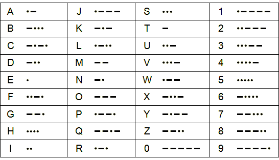

## What is Morse Code?

Invented by Samuel Morse in 1836, Morse Code is a method for sending and receiving text messages using short and long beeps. Conventionally, a short beep is called a **dot** and a long one is a **dash** (also known, respectively, as a **dit** and a **dah**). Every letter of the alphabet has a unique sequence of dots and dashes.

If you look at the chart below, the letter **A** is beep beeeeeep and the letter **B** is beeeeeep beep beep beep.

- All timings are defined as multiples of one dot length
- A dash is three times the length of a dot
- Each dot or dash has a short gap of silence after it (usually 1 dot length)
- Letters in a word have a slightly longer gap of silence between them (usually 3 dot lengths)
- Words have an even longer gap of silence between them (usually 7 dot lengths)

You don't necessarily need to use sound for this, although this is the most common way Morse Code was used. You can do it with anything that can be turned on and off; this could be a torch, raising and lowering a flag, or even just blinking your eyes quickly and slowly. This makes it one of the most versatile forms of telecommunication. There is even a formal international treaty which enshrines the Morse Code for SOS `... --- ...` (Save Our Souls) as a universal distress signal.

In the 1890s Morse Code was adapted for use with early radio before it was possible to send and receive voice. This was done by simply sending pulses of a carrier wave at an agreed frequency. The recipient's radio would then just play an audible tone whenever the carrier was received. It was used extensively during both World Wars and is still used to this day by amateur radio operators.

There are three essentials to using Morse:

- Knowing the code
- Being able to key it in
- Being able to decode it when listening

The choice of the dot and dash combination for each letter is not random. Samuel Morse based his decision on how often letters occurred in the English language used by his local newspaper. The more commonly-used a letter was, the fewer dots and dashes he chose, thereby making it faster to key in.

The chart below is the Morse Code tree, and is really helpful when listening and decoding; you might want to print it out and keep it in front of you. You can see that **E** and **T** are the most common letters. So you start at the top, go to the left if you hear a dot and to the right if you hear a dash. You can double-check this against the first chart: try it now for the letters **A** and **B**.

Get a pencil and paper and see how you get on with this: [listen to slow Morse Code](sounds/slow_morse.mp3). Don't be intimidated if you find following the code hard; it's always tricky to start with. As with many things, the more you do it the easier it gets.

