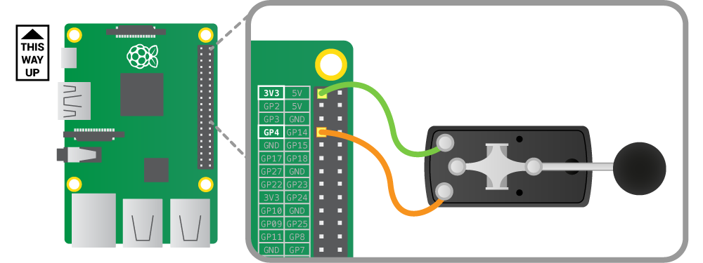
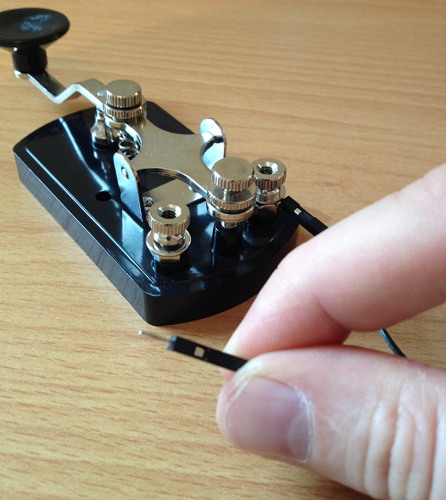

## Connect the Morse Code key to the GPIO pins

All Morse Code keys work in a similar way to a push button or switch. They have two screw terminals, to which a positive and a negative wire are attached. When you press the key down, two bits of metal touch, causing a circuit to complete. The effect would be the same if you just touched the two wires together.

To connect the Morse key to the GPIO pins, we need to do a bit of physical computing. GPIO pins can be set up as an input or an output. Output mode is used when you want to supply voltage to a device like an LED or buzzer. If we use input mode instead, a GPIO pin has a value that we can read in our code. If the pin has voltage going into it, the reading would be `1` (HIGH); if the pin was connected directly to ground (no voltage), the reading would be `0` (LOW). 

The goal is to use the Morse Code key to switch voltage on and off for a GPIO pin, thus making the reading of the pin change in our code when we press the key.

When a GPIO pin is in input mode the pin is said to be floating, meaning that it has no fixed voltage level. That's no good for what we want, as the pin will randomly float between HIGH and LOW. For this project, we need to know categorically whether the key is up or down. So we need to fix the voltage level to HIGH or LOW, and then make it change only when the key is pressed. We can do this in two ways.

### A pull up circuit

Wire the GPIO pin to 3.3 volts through a large 10kΩ resistor so that it always reads HIGH. Then we can short the pin to ground via the Morse key, so that the pin will go LOW when you press it.

  

### A pull down circuit

  Wire the GPIO pin to ground through a large 10kΩ resistor so that it always reads LOW. Then we can short the pin to 3.3 volts through the Morse key, so that it goes HIGH when you press it. When the key is pressed there is a lower resistance path to 3.3 volts, and therefore the pin will read HIGH. 

  
  
Note: The 1kΩ R2 resistor is there in both circuits to give the GPIO pin a fail-safe protection, in case we mistakenly set the pin to be in OUTPUT mode.

Fortunately, the Raspberry Pi has all the above circuitry built in and we can select either a pull up or a pull down circuit in our code for each GPIO pin. This sets up some internal circuitry that is too small for us to see. So you can get away with just using two jumper wires here, although you're welcome to wire it up the way shown above if you wish. Let's use GPIO pin #4 as an example:

### Pull up configuration

  GPIO pin #4 will be wired to 3.3 volts using the internal pull up resistor, so that it always reads HIGH. Then we can short the pin to ground via the Morse key, so that the pin will go LOW when you press it.

   

### Pull down configuration

  GPIO pin #4 will be wired to ground using the internal pull down resistor, so that it always reads LOW. Then we can short the pin to 3.3 volts via the Morse key, so that the pin will go HIGH when you press it.

   

Both methods will work equally well; which one people use is often just personal preference. Take the two jumper wires and screw the male ends into the terminal blocks on your Morse Code key. On some very old antique keys this can be a tricky operation.

 

Choose the pull up or down configuration you want to use and connect the female ends to the appropriate GPIO pins on your Raspberry Pi; use the above diagrams as a guide. Make a note of which configuration you're using as you'll need to incorporate it into your programming later. **In this worksheet, the examples given use a pull up configuration: you may use a pull down configuration if you wish, but remember that you will have to alter your code accordingly**.

