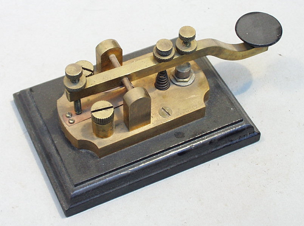
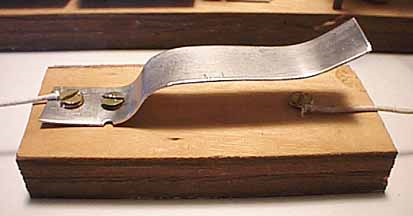

# Hardware Requirements

A real Morse Code key will bring this project to life, especially if you can acquire an antique one. These can often be found in local antique shops all over the country. Alternatively you can also buy one online; see the links below.

- Buy new online (try [nevada radio](http://www.nevadaradio.co.uk/amateur-radio/morse-keys/mfj-550))

  

- Find an antique (try [eBay](http://search.ebay.co.uk/antique+morse+code+key))

  Make sure it works!

  

- Make your own!

  
